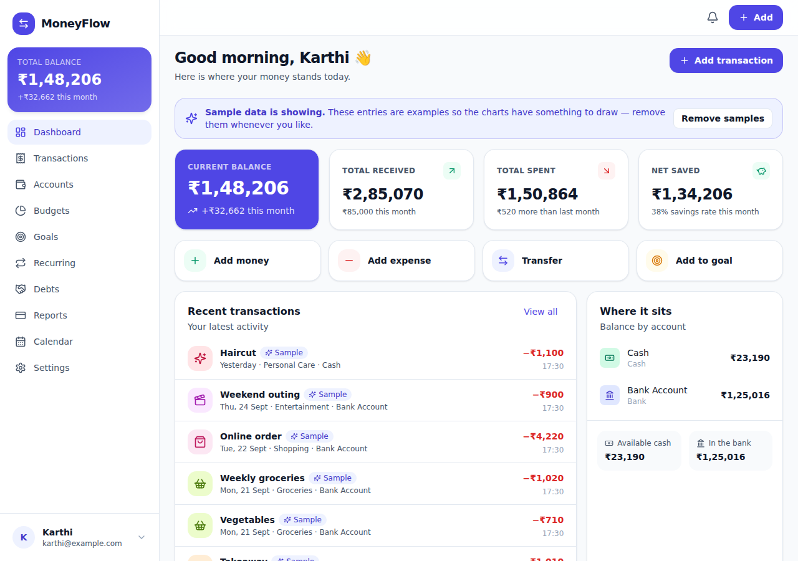
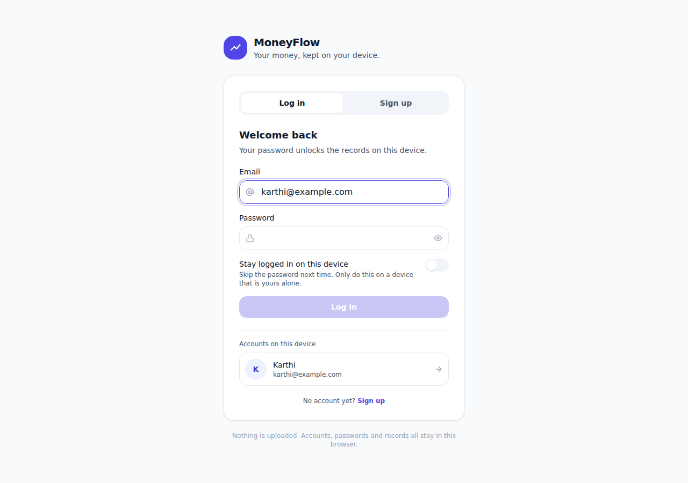
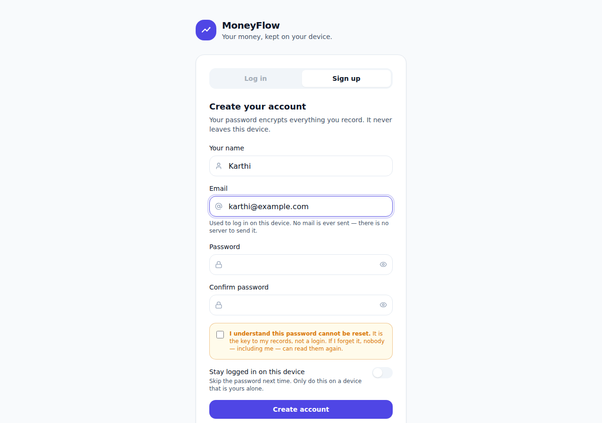
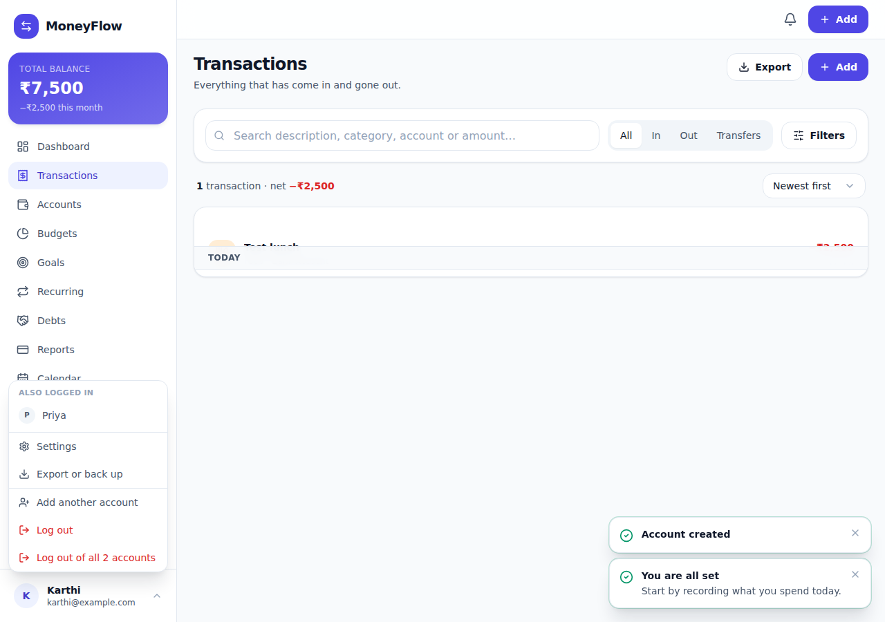
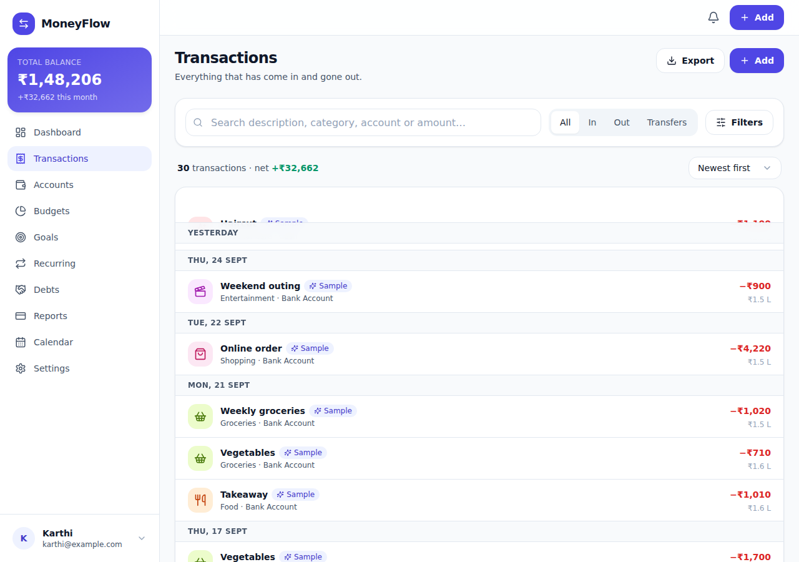
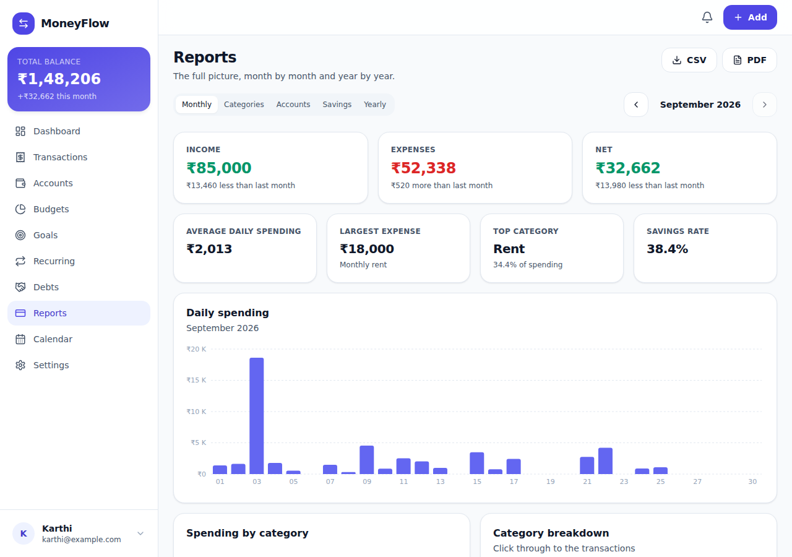
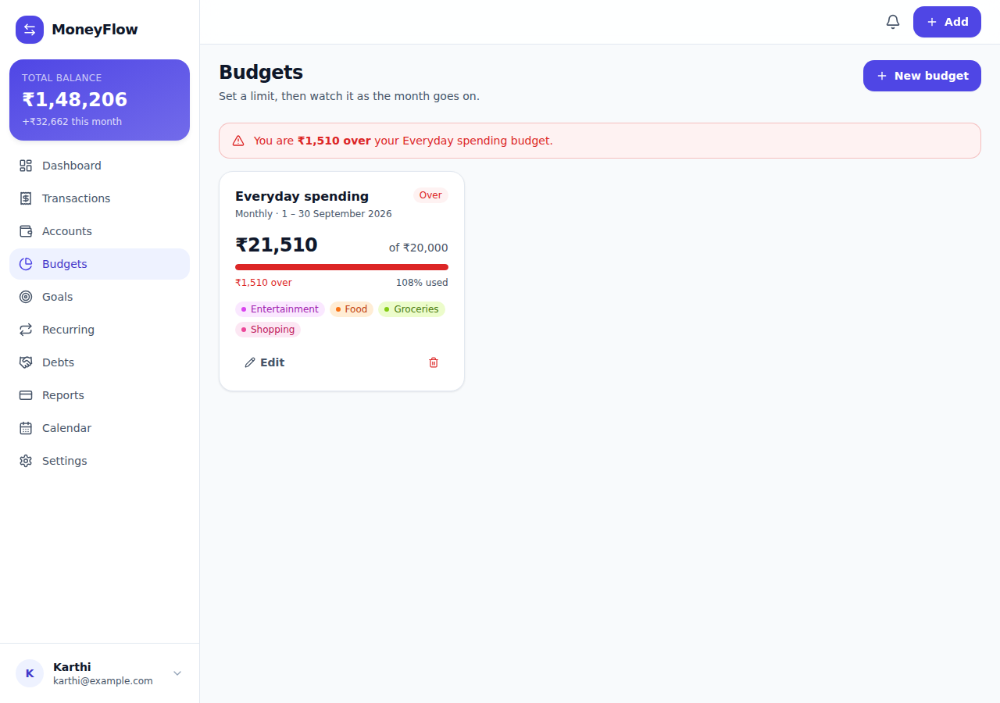

# MoneyFlow

A personal money tracker that runs entirely in your browser. No account, no
server, no data leaving your device.

Sign up, record what you earn and spend, and it tells you where your
money actually goes — with budgets, savings goals, recurring payments, debts,
reports and a calendar. Your password encrypts the whole ledger; everything is
stored locally, works offline, and can be exported at any time.

**[Live demo →](https://YOUR-USERNAME.github.io/moneyflow/)**



---

## Why it works this way

Most money trackers ask you to hand your financial history to a company. This
one does not have anywhere to send it. There is no backend, no API and no
account — the ledger, the calculations and the storage all live in the tab.

That has consequences worth being honest about, in both directions:

| | |
|---|---|
| **Private by construction** | There is no server to leak, subpoena or sell. Turn the network off and everything still works. |
| **Encrypted with your password** | AES-256-GCM, under a key stretched from your password with 600,000 rounds of PBKDF2. Someone with the browser files but not the password has nothing readable. |
| **Nothing can reset that password** | It is the key, not a login. There is no recovery path, because any recovery path would also be a way in. The sign-up screen makes you acknowledge this before the account exists. |
| **Yours to take** | One button gives you a complete JSON backup or a CSV of every transaction. |
| **Tied to one browser** | The data lives in *this* browser on *this* device. Clearing site data deletes it. Export backups. |
| **No bank sync** | Every figure is one you entered. Nothing is imported or guessed. |

The Settings → Storage page says all of this inside the app too, because
someone deciding whether to trust it with their money deserves to know where
that money data is sitting.

## Features

**Accounts and security**
- Sign up with your name, email and a password; log in with the email and password, the way you would expect
- The email is an identifier, not a channel — no mail is ever sent, because there is nowhere to send it from
- The password encrypts your ledger rather than asking a server whether it is right
- Several accounts on one device — you, your partner, the shop — each with its own vault
- More than one logged in at a time, switched from the sidebar menu with no password re-typed
- Log out of one account or all of them; logging one out hands the app to the next, not to the login screen
- Automatic log-out after a chosen idle time
- Change your password and the whole ledger is re-encrypted under the new one
- Optional "stay signed in on this device", off by default and explained where it is offered

**Money**
- Income, expenses, transfers between your own accounts, and balance adjustments
- Multiple accounts — cash, bank, wallet, credit card, savings, investment
- 31 starter categories, all of them editable, archivable or replaceable
- Search, filter by type, account, category, amount and date, with a running balance

**Planning**
- Budgets over any set of categories, weekly, monthly or yearly, with a safe daily allowance
- Savings goals with contributions, progress and what you need to set aside each month
- Recurring transactions and subscriptions, posted automatically and idempotently
- Debts you owe and debts owed to you, with repayments that move the money too

**Understanding**
- A dashboard that answers "what have I got, what came in, what went out"
- Monthly, category, account, savings and yearly reports
- A calendar view of the month's activity
- Rule-based insights that describe what happened — never advice

**Practical**
- Works offline, installable as a PWA
- Light and dark themes, following the system by default
- Keyboard accessible, and built mobile-first
- CSV, JSON and PDF exports generated in the browser

<details>
<summary><strong>More screenshots</strong></summary>








</details>

## Running it

```bash
npm install
npm run dev         # http://localhost:5173
```

Other scripts:

```bash
npm run build       # typecheck, then build to dist/
npm test            # the engine test suite
npm run typecheck   # types only
npm run preview     # serve the production build on :4173
npm run verify      # drive the built app in a real browser (needs `preview` running)
```

## Deploying it

Push to `main` and the included workflow builds, tests and publishes to GitHub
Pages. The only setup is **Settings → Pages → Source → "GitHub Actions"**.
There is nothing to configure beyond that — no secrets, no environment
variables, no backend to point at.

It works on any static host for the same reason: `vite.config.ts` sets
`base: './'` and the app uses hash routing, so it runs from a subfolder or a
custom domain without changes. It does need to be served over **https://** (or
localhost) — browsers only allow encryption on a secure page, so opening the
files directly off disk will not work.

## How it is built

React 18, TypeScript, Vite, Tailwind, Recharts. No state library, no data
fetching library — with no network there is nothing to cache or invalidate.

```
src/
  core/        The engine. Pure TypeScript, no React, no browser APIs.
    types.ts       The whole data model
    money.ts       Integer minor units and exact parsing
    ledger.ts      Balance derivation — the heart of it
    operations.ts  Every write, each returning a new database
    analytics.ts   Totals, series and reports
    crypto.ts      Key derivation and vault encryption
    budgets.ts  goals.ts  recurring.ts  debts.ts  insights.ts  notifications.ts
    schema.ts      Versioning, migration, and parsing untrusted data
  store/       Persistence and the React binding
    persistence.ts IndexedDB (localStorage fallback) holding one vault per account
    SessionProvider.tsx Accounts, sign-in, locking
    LedgerProvider.tsx  One immutable database in React state, mounted per account
  hooks/       The read and write hooks the pages use
  components/  UI
  pages/       Screens
```

### Four decisions that shape everything else

**Money is an integer count of minor units.** Paise for rupees, cents for
dollars. There is no floating point anywhere in the money path, and every
variable holding one is named with a `Minor` suffix so a mistake is visible at
the call site. Input is parsed digit by digit from the text you typed —
`"1.2.3"` is rejected rather than guessed at, and `"10.555"` is an error rather
than a silent rounding.

**Balances are derived, never stored.** A transaction is what you typed; its
effect on an account is computed on demand. An account balance is always
`opening balance + Σ effects`. Nothing is cached, so nothing can go stale:
editing a transaction cannot double-count, deleting one cannot leave a residue,
and no code path exists that could produce a balance disagreeing with the
transaction list.

**Writes are pure functions.** Every operation takes the database and returns a
new one, or throws. A failed validation leaves the previous state completely
untouched — there is no half-applied write to clean up — and React gets a
reliable change signal for free.

**The password is the key.** With no server there is nothing to authenticate
against, so a password that merely gated the UI would protect nothing — the
data would still be sitting in IndexedDB for anyone to read. Instead the
password derives the AES key, and "wrong password" is simply the vault failing
to decrypt. It also means the app needs a secure context to run at all: HTTPS
or localhost, which is what the Web Crypto API requires. The decrypted ledger
lives only in memory, inside a provider that unmounts when you lock.

## Testing

```bash
npm test
```

104 tests over the engine: the money primitives, balance derivation under edits
and deletes, calendar arithmetic, recurring schedules, budgets, goals, debts,
analytics, the alert rules, storage parsing, the exports, and the encryption —
including that the wrong password fails rather than returning rubbish, that two
accounts sharing a password cannot read each other, and that changing a
password keeps the data while retiring the old key.

The one that matters most is `tests/acceptance.test.ts`, which walks the
specification's worked example figure for figure — ₹10,000 opening balance,
₹60,000 in, ₹25,000 out, an edit, a delete, and a transfer — asserting on
integer paise at every step, so nothing can pass by a rounding coincidence.

`npm run verify` goes further and drives the built app in a real browser:
signing up (including rejecting a malformed address), completing the setup wizard, recording a transaction,
**reading the raw bytes back out of IndexedDB to confirm the ledger is not
readable there**, reloading to prove persistence, logging out and back in with the email and
password, opening a second account alongside the first and checking it cannot
see the first one's records, rejecting the wrong password and giving an unknown address the same
answer rather than a hint, changing the password and checking the old one stops
working, confirming the charts actually draw, loading sample data,
exporting a CSV, and reloading with the network switched off. It fails on any
console error or failed request.

## Licence

MIT — see [LICENSE](LICENSE).

MoneyFlow is a record-keeping tool. It does not give financial advice, and
every figure it shows is derived from what you entered.
